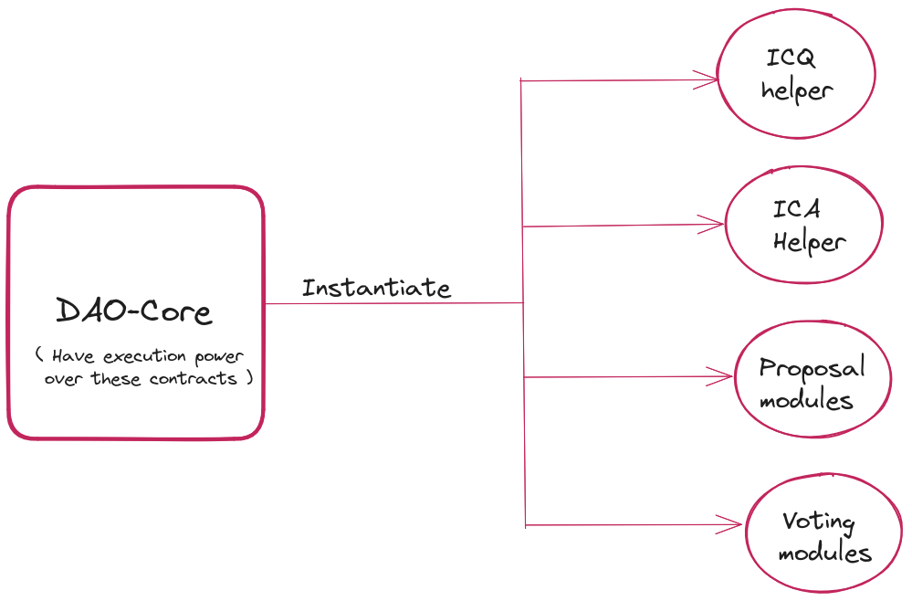
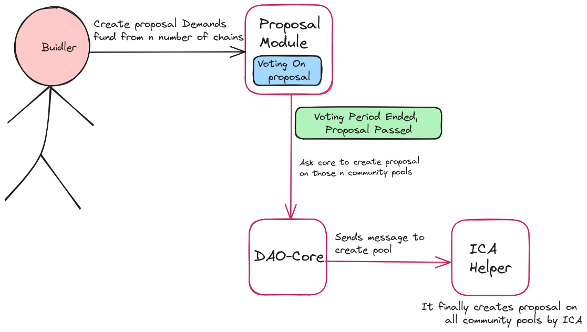
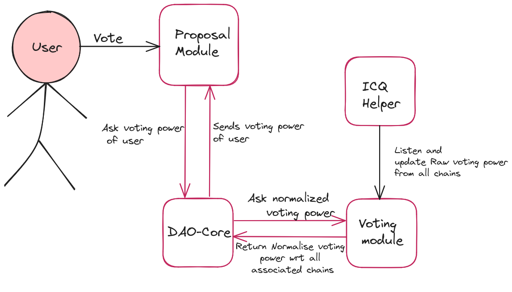

# Accelarator DAO

## 1. Abstract
PAIDs(Permissionless aggregated interchain Dao) are interchain DAOs to aggregate the funds of community pools of multiple chains in order to make aggregated decision making for common goals.

<!-- Community pools on multiple cosmos chains can aggregate a portion of their funds into a common pool and collectively decide on how to spend the collective funds and stakers of each chain can reuse their staked voting power to vote in this DAO removing any additional friction for community pool voters. -->
Within the Cosmos ecosystem, community pools in different chains can pool a portion of their resources into a central fund, enabling them to jointly determine how to allocate these pooled resources. Additionally, individuals who have staked tokens in each chain can use their staking power within this DAO. This eliminates any extra obstacles for voters from community pools, streamlining the decision-making process.

## 2. Problem Statement

A community pool is a portion of assets held by the chain and controlled by on-chain voting. These community pools serve as a means to support the growth and development of their respective chains,  whether it involves enhancing features, providing liquidity, or any expenditure that contributes to the chain's advancement.

We're now in interchain era as IBC as matured by a lot and there are 100+ IBC enabled chains within cosmos. Each of these chains has their own community pool and that in most chains is only constituted of the chain's gas token, such as ATOM for Cosmos Hub, OSMO for Osmosis and so on.

Community pools can only spend in their own gas token and it's inefficient to convert the tokens to some other denom primarily due to lack of deep liquidity and secondary due to lack of infrastructure of doing so permissionlessly.

There are cases where multiple community pool funded DAOs come in verbal aggrement to split funding a proposal amongst them, so there can be proposal which are partially funded by ATOM and partially by OSMO cause the proposal's work would be used both by Cosmos Hub and Osmosis chain. Here Neither ATOM is coverted to OSMO nor OSMO to ATOM through a liquidity pool before funding the proposal instead some portion of Hub's community pool (denominated in ATOM) and some portion of Osmosis (denominated in OSMO) is used to fund but this is bespoke and requires verbal agreements.

PAIDs solve this very problem by allowing community pools of multiple chains to form a DAO and permissionlessly send funds to this DAO and stakers of each of the chains can vote for proposals on this DAO. As an example, if a staker has 6% of all staked ATOM on Hub and the DAO has 50% say of Hub then this staker will automatically get 3% voting power in this DAO without having to unstake or restake their ATOM or any other asset.

As an example, if there is a team building a Comos-sdk module that is quite useful to a DEX chain, for example, Osmois, Kujira, Crescent can utilize this module in their chain, then the team can create a proposal on a DAO which makes CommunityPoolSpend proposal on each of these chains simultaneously and the team is funded by all 3 chains with the team just creating a single governance proposal with amount of all 3 assets (X OSMO, Y KUJI, Z CRE) and the DAO itself handles the creation of CommunityPool spend proposal, getting funds from that chain to the proposer team and even allowing the stakers of each of these 3 chains on the proposal by reusing the voting power from staked OSMO, KUJI and CRE.

Another example could be, a team building a CosmWasm tooling and all the chains having CosmWasm support (10+ within Cosmos) interested in this tooling would love to fund part of the amount. So, the team will propose on a DAO having Neutron, Juno, Osmosis, Archway community pools connected. The DAO upon creating a proposal by the team, will get funds from the respective community pools and will distribute to the team.


## Solution overview

The DAO is implemented using CosmWasm smart contracts and consists of 5 parts:

1. DAO Core: Stitches all parts of DAO together and tracks the % split of each chain in the DAO
2. Proposal module: Helps create proposals with ICA messages embedded by default
3. Voting module: Helps in voting for proposal using staked assets on remote chains
4. ICA helper: Does the ICA transactions on remote chains and IBC transfers
5. ICQ helper: Does interchain queries on remote chains for staked assets, balances and unstaking/staking events

**Note:** For in-depth project architecture and the flow of contracts, please refer to the contracts repository here at [https://github.com/kubiklabs/gov-aggregator-contracts](https://github.com/kubiklabs/gov-aggregator-contracts)

## 3. Contracts list
The core contracts are as follows:

1. **dao_core**: This contract is the core module of ADAO. It handles management of voting power aided by voting module,proposal modules,ICA helper module, executes messages. It holds the DAO's treasury and tracks the % split of each chain in the DAO.
2. **Voting module**: Helps in voting for proposal using staked assets on remote chains.
<!-- 3. **pre-propose**: Proposer will interact with this contract which will modify messages accordingly and call the **propose** contract. -->
3. **Proposal module**: Helps create proposals with ICA messages embedded by default, vote is done by interacting with this contract and for passed proposal it will call core dao contract to execute the messages.
4. **ICQ helper**: Does interchain queries on remote chains for staked assets, balances and unstaking/staking events. 
5. **ICA helper**: Does the ICA transactions on remote chains and IBC transfers, e.g. creating commuity pool spend proposal, transferring funds from remote chain to the DAO treasury over IBC, sending the DAO treasury back to remote chain's community pool over IBC.

## Key features

In summary, the interchain DAO does following:

1. Create CommunityPoolSpend proposals on any chain from Neutron using smart contracts and ICA over IBC
2. Keep track of voting power of staked asset on any chain and report to Neutron, so that stakers of that chain can vote in this DAO withoout doing anything extra
3. Transfer funds between DAO and remote chains over IBC

## How we implemented

1. The work uses DAO-DAO contracts as starting point
2. Proposal module was modified to accomodate creating of ICA proposals
3. Voting module was modified to accomodate tracking staked asset on remote chain as voting power
4. DAO core module was modified to store split of multiple chains 
5. ICA helper was created, that does the CommunityPoolSpend proposal, IBC asset transfers
5. ICQ helper was created, that does the interchain queries for voting power, asset balances and staking/unstaking events

## Future work

1. Allow funds to be vested and based upon deliverables
2. Allow Community pools to opt-out of a specific proposal
3. Chains to have Veto power in voting

## 4. Code flow diagram





## 4. Scripts and Setup

Setup directory helps in delegating tokens on different chain to aggreagte voting power to illustrate the DAO funations

The directory comprises two TypeScript files: "delegate.ts" and "undelegate.ts." These files offer the flexibility to configure various parameters, including the delegator's and validator's mnemonics, the chain's RPC (Remote Procedure Call) endpoint, and the specific amounts for delegating or undelegating tokens, among other customizable settings.

Run these commands for delegation/undelegation -
```
1. cd  ./setup
2. yarn install
3. npx tsc
4. node ./delegate.js   //to delegate
   node ./undelegate.js //to undelegate
``` 